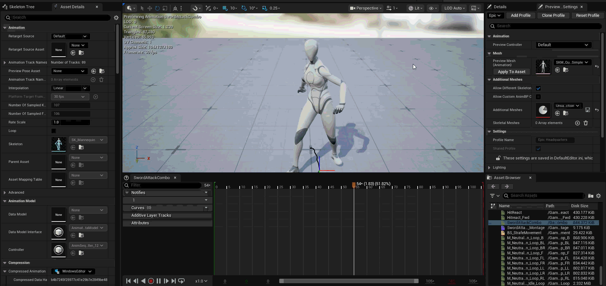
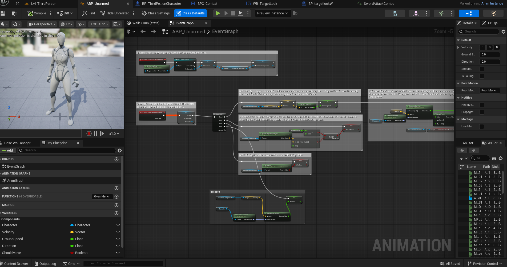
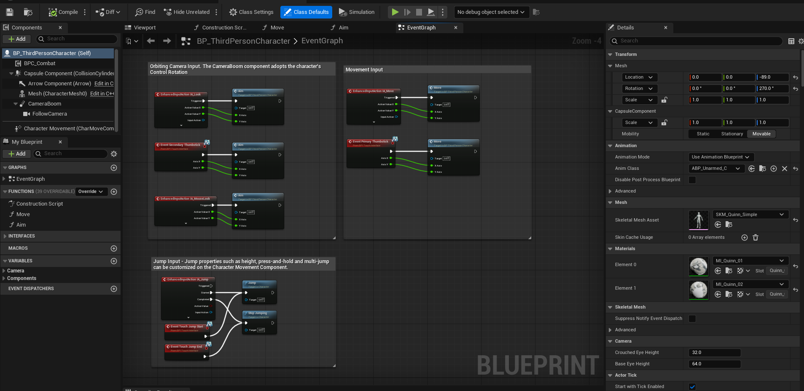
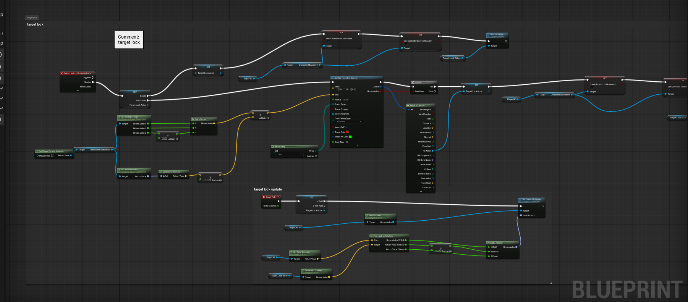

# Souls-Like-game-UE5
A third-person Souls-like action game developed in Unreal Engine 5, featuring melee combat, character locking, enemy AI, attack combos, animations, and Blueprint-based gameplay systems. The project is being developed toward a Souls-like combat and gameplay experience using and extending Unreal Engine templates.
## Status

In Development

## Features
* Third-person character movement
* Souls-like character locking/targeting system
* Melee combat and sword attacks
* Attack combo system
* Enemy AI and combat interactions
* Character and combat animations
* Blueprint-based gameplay systems
* Souls-like gameplay direction and presentation
* Template-based systems being adapted toward a Souls-like experience

## Some photos of progress

